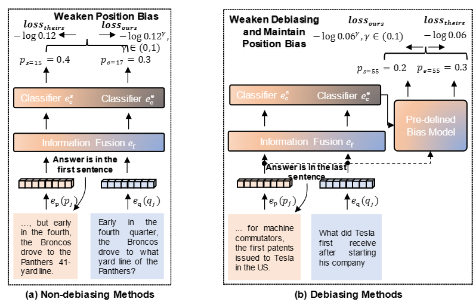

# ALO

ALO is a simple yet effective novel loss function with adaptive loose optimization, which seeks to make the best of both worlds for question answering: in-distribution and out-of-distribution. Its main technical contribution is to reduce the loss adaptively according to the ratio between the previous and current optimization state on mini-batch training data. This loose optimization can be used to prevent non-debiasing methods from overlearning data bias while enabling debiasing methods to maintain slight bias learning.


## ALO for Visual Question Answering

## ALO for Extractive Question Answering

## Citation
```
@article{ma2023adaptive,
  title={Adaptive loose optimization for robust question answering},
  author={Ma, Jie and Wang, Pinghui and Wang, Zewei and Kong, Dechen and Hu, Min and Han, Ting and Liu, Jun},
  journal={arXiv preprint arXiv:2305.03971},
  year={2023}
}
```


