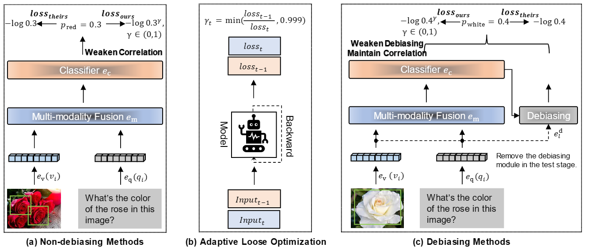
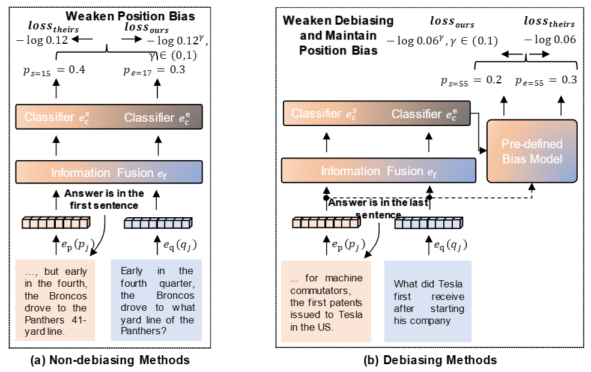

# ALO

## Introduction

ALO a simple yet effective novel loss function with ***A**daptive **L**oose **O**ptimization*, which seeks to make the best of both worlds for question answering: in-distribution and out-of-distribution. Its main technical contribution is to reduce the loss adaptively according to the ratio between the previous and current optimization state on mini-batch training data. This loose optimization technique can be used to prevent non-debiasing methods from overlearning data bias while enabling debiasing methods to maintain slight bias learning.

---

## Methods Overview

### Visual QA



<center>Figure 1. Comparison of non-debiasing and debiasing visual QA methods with or without adaptive loose optimization. The loose degree is controlled dynamically by the ratio of the last t − 1 and current t optimization states.</center>

### Extractive QA



<center>Figure 2. Comparison of non-debiasing and debiasing extractive QA methods with or without adaptive loose optimization.</center>

## Run

To run our ALO for ***Visual Question Answering***, follow the steps here [ALO for Visual Question Answering](https://github.com/reml-group/ALO/tree/main/vqa-alo).

To run our ALO for ***Extractive Question Answering***, follow the steps here [ALO for Extractive Question Answering](https://github.com/reml-group/ALO/tree/main/qa-alo).

## Citation
```
@article{ma2023adaptive,
  title={Adaptive loose optimization for robust question answering},
  author={Ma, Jie and Wang, Pinghui and Wang, Zewei and Kong, Dechen and Hu, Min and Han, Ting and Liu, Jun},
  journal={arXiv preprint arXiv:2305.03971},
  year={2023}
}
```

